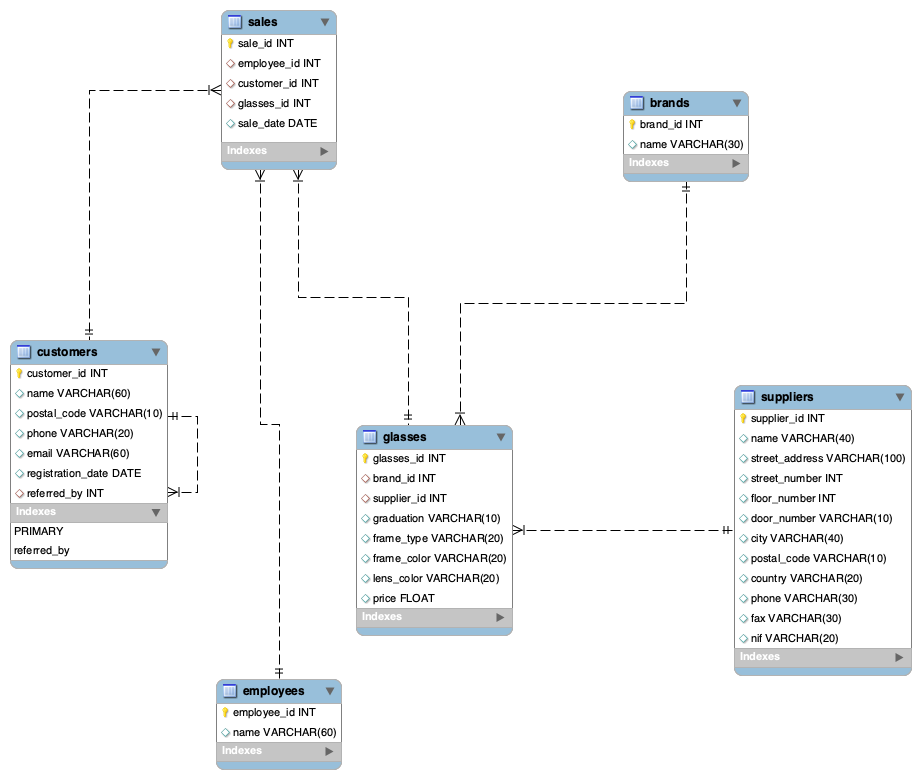
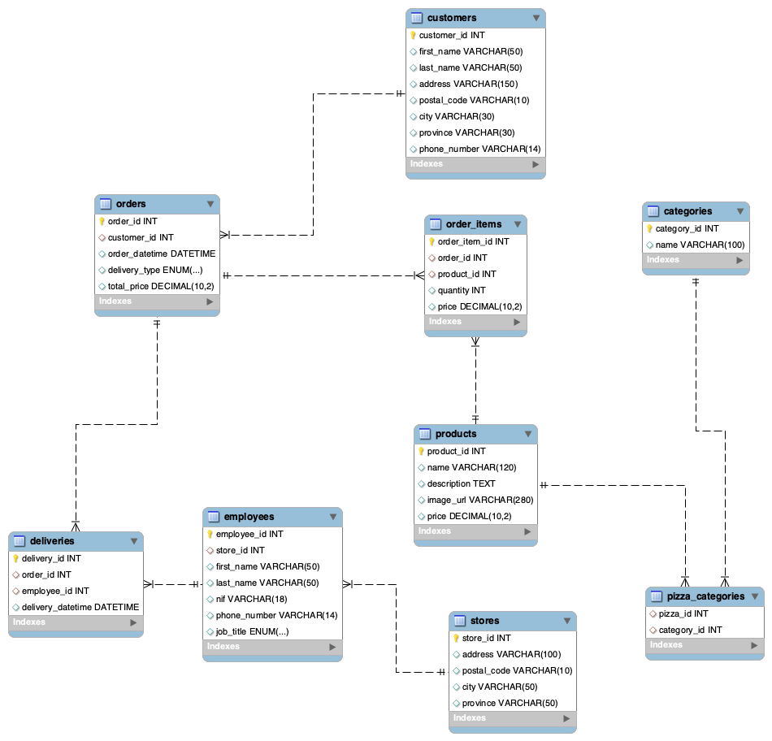
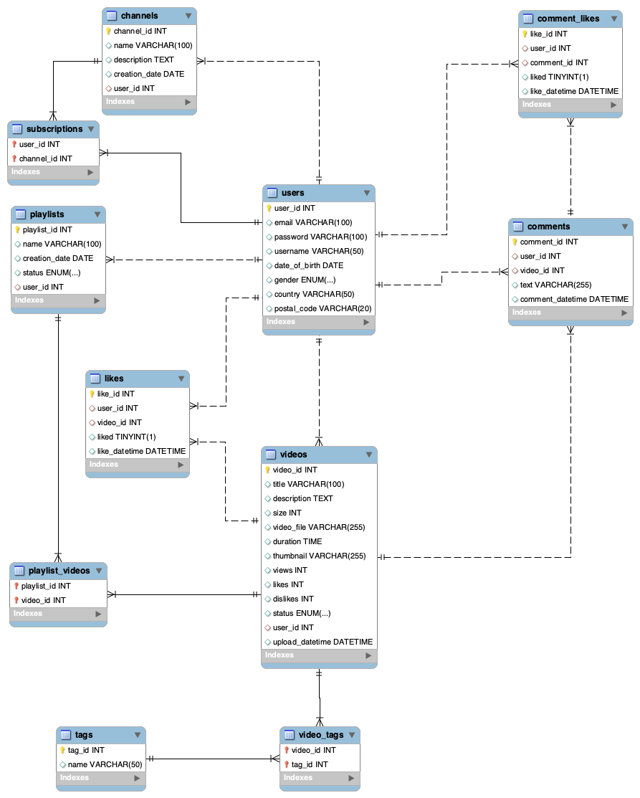
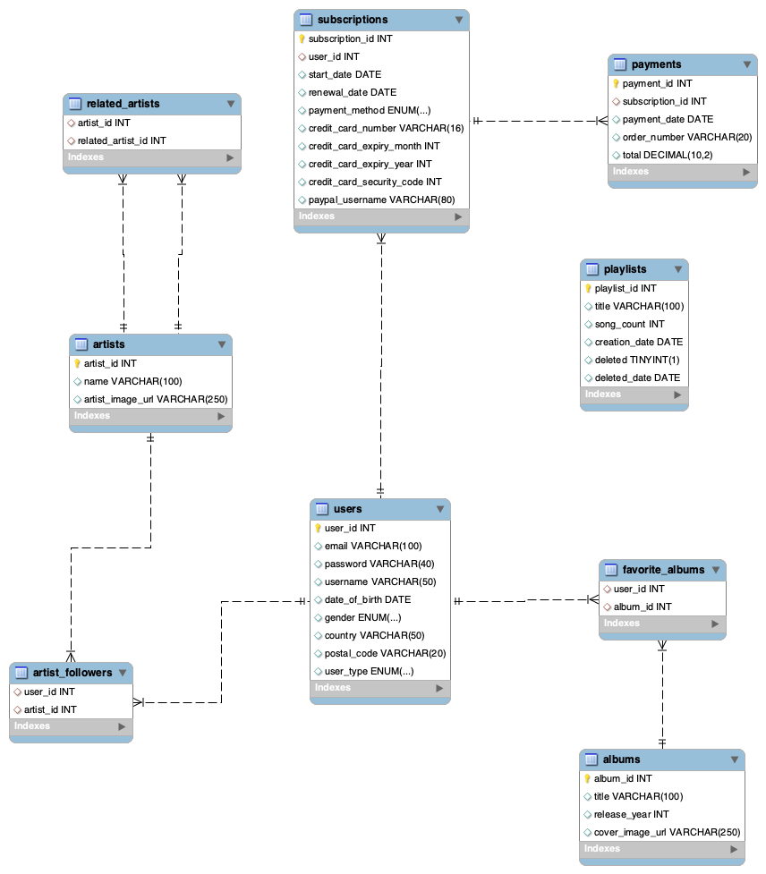

# sql-structure
>Development of database structures addressing concepts and practices related to MySQL for the design of "ER diagram" (Entity-Relationship diagram).

## Getting started

### Inicialize the project
1. Installs dependencies and compiles the TypeScript project.

```bash
npm run start
```

2. Launches and starts all the services defined in the Docker Compose configuration file:

```bash
npm run docker
```


### Insert data from javascript to mysql
1. Install MySQL Server: 
* Download and install MySQL Server from the official MySQL website (https://dev.mysql.com/downloads/mysql/).

2. Start the MySQL Server:
* On Unix-like systems, you can usually start the service using a command like sudo service mysql start.
* On Windows, you can start the service from the Services app or using the command prompt.

3. Create a MySQL Database:
```bash
CREATE DATABASE my_database;
```
4. Install mysql2 Package:
```bash
npm install mysql2
```
5. Connect to MySQL Database:
```ts
import mysql from 'mysql2';
import dotenv from 'dotenv';

dotenv.config()

const poolOptical = mysql.createPool({
  host: process.env.MYSQL_HOST,
  user: process.env.MYSQL_USER,
  password: process.env.MYSQL_PASSWORD,
  database: process.env.MYSQL_DATABASE,
  port: 3306 // same port to mysql server
});

export default poolOptical
```
6. Run application:
```bash
npm run inserts-optical
```

## Schemas

### Level 1 - Optical Store

The repository models the management of an optician. Here are the key points summarized:

| **Entities** | **Atributes**                                                                                                                 |
| -------------| ----------------------------------------------------------------------------------------------------------------------------- |
| Suppliers    | Name, address, phone, fax, TIN.                                                                                               |
| Glasses      | Brand, prescription, frame type, frame and lens color, price.                                                                 |
| Customers    | Name, address, phone, email, registration date. When registering a new customer, store who recommended them.                  |
| Sales        | Sales	Register the employee who made the sale and define a time period.                                                      |

>[!NOTE]
>To perform these verifications, you can find the query scripts in the directory src/optical_store/scripts. Refer to these scripts to verify that the design is correct.

**Optics Verification Queries:** 

1. List the total purchases of a customer.
2. List the different glasses sold by an employee during a year.
3. List the different suppliers who have supplied glasses successfully sold for the optician.

**Entity-Relationship diagram**
<details>
<summary>👀 see diagram</summary>


</details>
<br>

### Level 1 - Pizzeria

| **Entities** | **Atributes**                                                                                                                 |
| -------------| ----------------------------------------------------------------------------------------------------------------------------- |
| Customers    | first_name, last_name, address, postal_code, city, procince, phone_number                                                     |
| Orders       | order_id, customer_id, order_datatime, delivery_type, total_price                                                             |
| Products     | product_id, name, description, image_url, price                                                                               |
| Employees    | employee_id, store_id, first_name, last_name, nif, phone_number, job_title                                                    |
                                                
>[!NOTE] 
>To perform these verifications, you can find the query scripts in the directory src/pizzeria/scripts. Refer to these scripts to verify that the design is correct.

**Pizzeria Verification Queries:**

1. List how many "Drinks" products have been sold in a specific location.
2. List how many orders a specific employee has made.


**Entity-Relationship diagram**

<details>
<summary>👀 see diagram</summary>


</details>
<br>

### Level 2 - YouTube

This level represents a reduced version of YouTube with the following features:

| **Entities** | **Atributes**                                                                                                                 |
| -------------| ----------------------------------------------------------------------------------------------------------------------------- |
| users        | users_id, email, password, username, date, gender, country, postal_code                                                       |
| videos       | video_id, title, description, size, video_file, duration, thumbnail, views, likes, dislikes, status, upload_datetime          |
| channels     | channels_id, name, description, creation_date                                                                                 |
| playlists    | playlist_id, name, creation_date, status                                                                                      |

>[!NOTE] 
>To perform these verifications, you can find the query scripts in the directory src/youtube/scripts. Refer to these scripts to verify that the design is correct.

**Entity-Relationship diagram**

<details>
<summary>👀 see diagram</summary>


</details>
<br>

### Level 3 - Spotify

This level represents a reduced version of Spotify with the following features:

| **Entities**                | **Atributes**                                                                                                                                                                   |
| ----------------------------| ------------------------------------------------------------------------------------------------------------------------------------------------------------------------------- |
| users                       | users_id, email, password, username, date, gender, country, postal_code                                                                                                         |
| subscriptions               | start_date, renewal_date, payment_method, credit_card_number, credit_card_expiry_month, credit_card_number, credit_card_expiry_year, credit_card_security_code, paypal_username |
| channels                    | channels_id, name, description, creation_date                                                                                                                                   |
| playlists                   | playlist_id, title, song_count, creation_date, deleted, deleted_date                                                                                                            |
| artist and albums           | uniqueid, names, images                                                                                                                                                         |

>[!NOTE] 
>To perform these verifications, you can find the query scripts in the directory src/spotify/scripts. Refer to these scripts to verify that the design is correct.


**Entity-Relationship diagram**

<details>
<summary>👀 see diagram</summary>


</details>
<br>

## License

This project is licensed under the MIT License - see the LICENSE.md file for more details.
